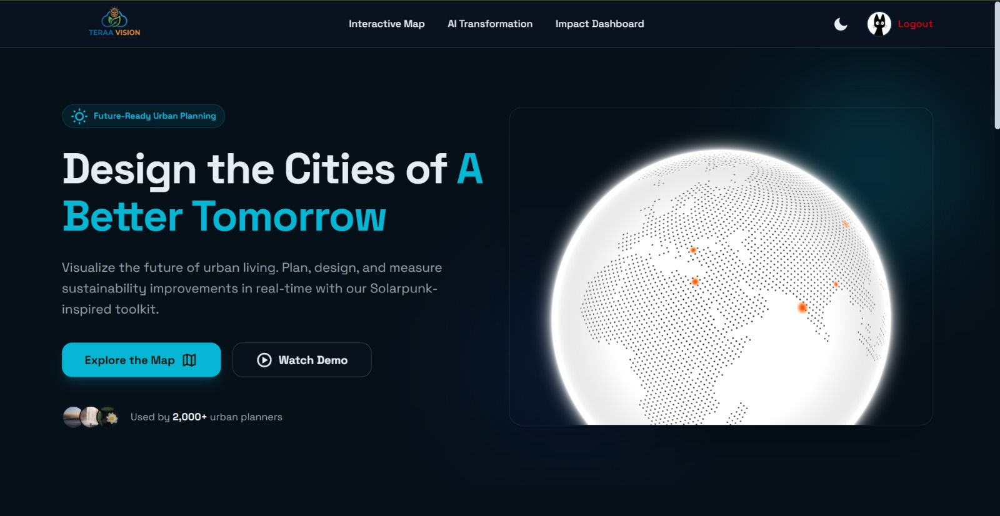
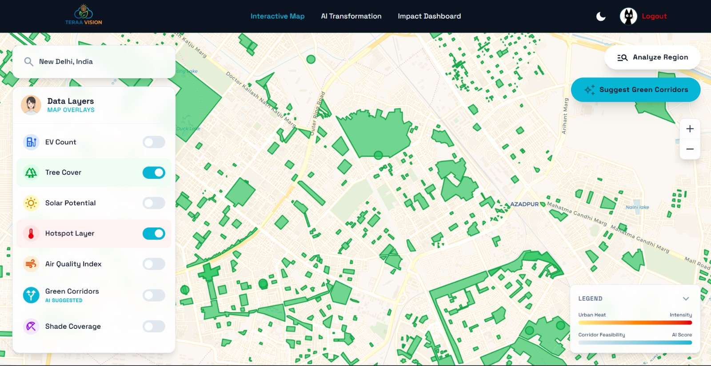
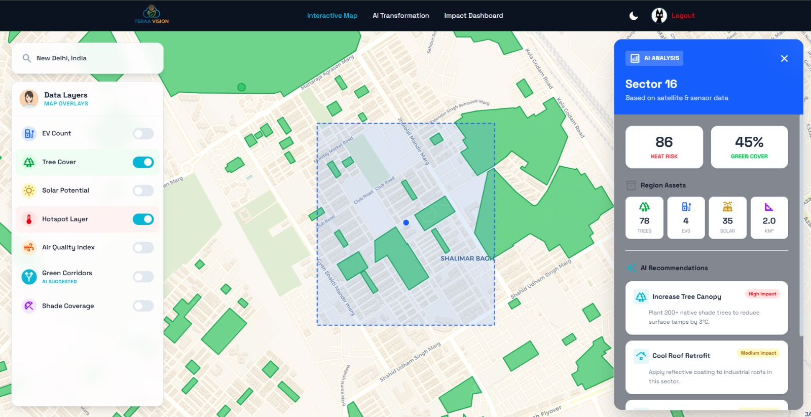
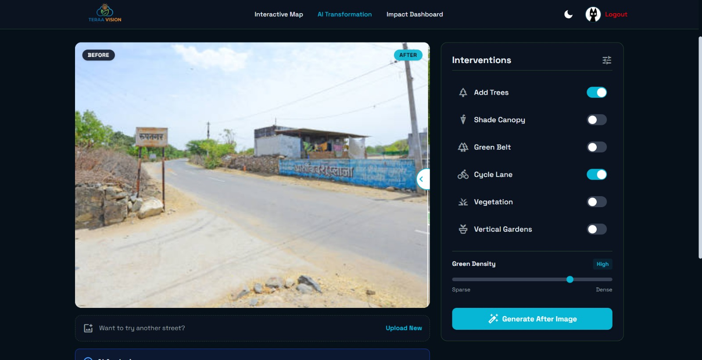
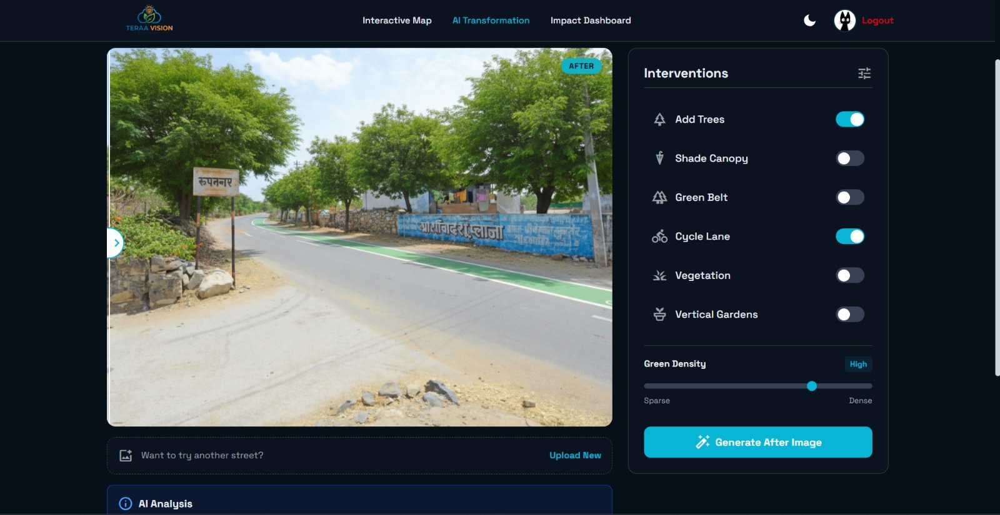
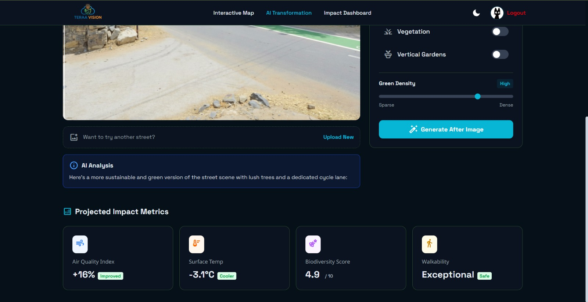
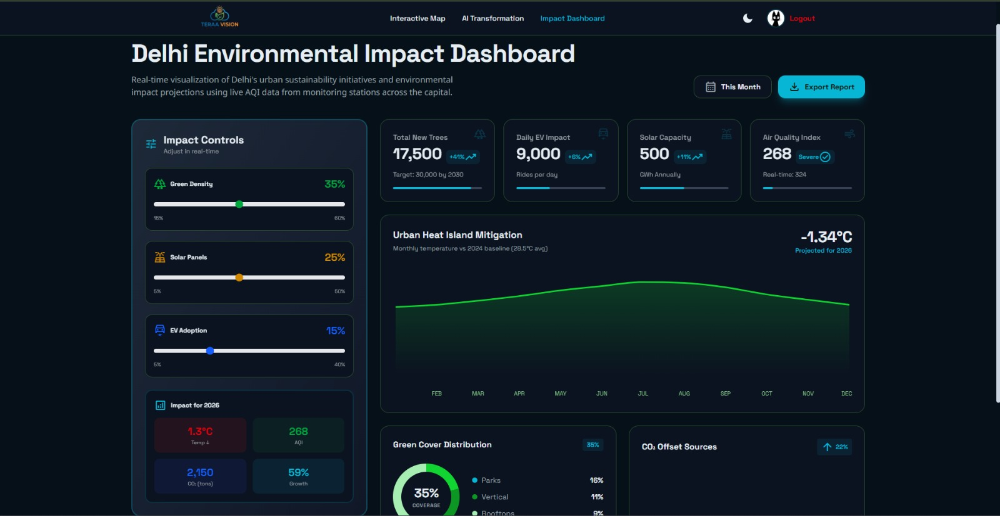
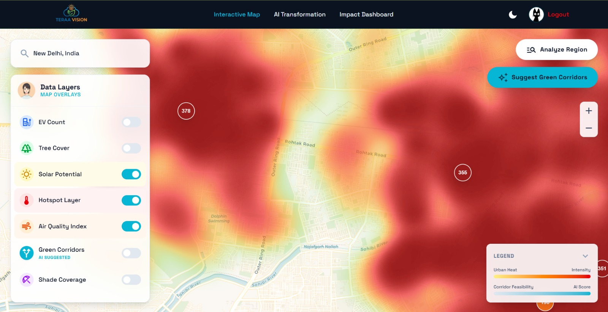
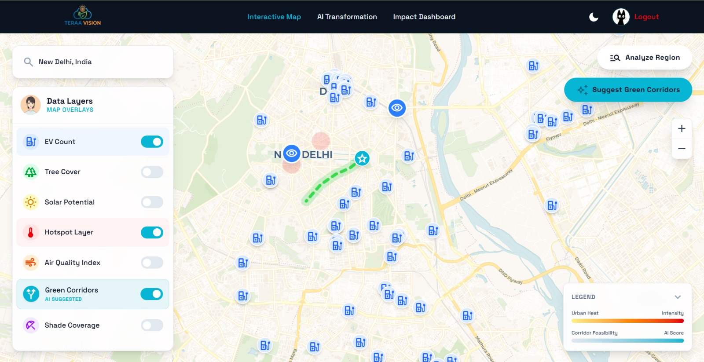

# Hero Section

## TerraVision

### Core Technologies

React • TypeScript • Firebase • Gemini • Leaflet • GeoJSON • Recharts


> Geospatial sustainability platform with AI-assisted analysis and urban planning visualizations.

🌐 Live Demo: https://terra-vision-tan.vercel.app/

🏆 Top 5 Finalist — InnovateNSUT '26

---

# Overview

TerraVision is a geospatial sustainability platform that combines interactive mapping, environmental datasets, and AI-assisted analysis to help visualize urban planning interventions. Users can explore AQI, tree cover, EV infrastructure, solar installations, and population density through layered maps, corridor analysis, and scenario-based dashboards.

---

# Key Features

## Interactive Geospatial Map Exploration
Browse a Leaflet-based map with toggled layers and a project marker focused on Delhi.

## Multi-Layer GeoJSON Visualization
Inspect EV charging stations, tree cover, and solar infrastructure from static GeoJSON datasets.

## Environmental Dataset Integration
Load AQI station data from XML and population data from CSV + Delhi ward boundaries for context-aware analysis, including heatmap overlays.

## Green Corridor Analysis
Run Gemini-backed region analysis on a selected area and render a suggested corridor path on the map.

## Gemini-Powered Insights
Generate region summaries, sustainability recommendations, and street transformation results through the Gemini service layer.

## Street Transformation Previews
Upload a street image, generate an AI-transformed version, and compare before/after with the slider component.

## Sustainability Dashboard
Use slider-driven scenario controls and Recharts charts to view estimated changes in temperature, AQI, CO2, trees, solar capacity, and EV impact.

## Firebase Authentication
Sign in with email/password or Google, then access protected routes and Firestore-backed profile data.

# Screenshots

## Landing Page



The main entry point showcasing TerraVision's sustainability-focused urban planning platform.

---

## Interactive Map Explorer



Explore multiple environmental and infrastructure datasets including tree cover, EV charging stations, solar infrastructure, AQI hotspots, and AI-generated green corridors.

---

## Region Analysis & Recommendations



Select a region and generate contextual sustainability insights, environmental metrics, and intervention recommendations.

---

## AI-Powered Street Transformation

### Before



### After



Generate sustainable urban redesigns using configurable interventions such as tree planting, cycle lanes, green belts, and vegetation density.

---

## Projected Impact Metrics



Evaluate environmental outcomes including AQI improvement, temperature reduction, biodiversity impact, and walkability scores.

---

## Sustainability Impact Dashboard



Analyze scenario-based projections for green density, solar adoption, EV adoption, carbon reduction, and urban heat mitigation.

---

## AQI Heatmap Visualization



Visualize air-quality hotspots and identify regions requiring environmental intervention.

---

## Green Corridor Planning



Generate and visualize suggested green corridor routes using environmental and infrastructure context.

# Data Sources

| Source | Purpose | Usage |
|---|---|---|
| EV Charging Stations | Infrastructure layer | Plotted as map markers and used in region analysis |
| Tree Cover Data | Green cover layer | Rendered as polygons/points and used for corridor constraints |
| Solar Infrastructure | Renewable layer | Rendered on the map and used in sustainability analysis |
| AQI Data | Air quality context | Parsed from XML and displayed as AQI stations + heat layer |
| Population Data | Ward-level density context | Combined with Delhi ward boundaries for population overview and map overlays |

---

# AI Features

TerraVision currently uses Gemini for implemented, user-facing workflows only:

| Feature | What it does |
|---|---|
| Contextual region analysis | Summarizes a selected region using local map data and active layers |
| Sustainability recommendations | Produces green corridor suggestions with a path, reasoning, and feature list |
| Street transformation generation | Generates an edited street image and a short analysis from an uploaded photo |

These flows are backed by the existing service layer and local datasets; there are no custom-trained models or advanced forecasting pipelines in the repo.

---

# Getting Started

## Installation

```bash
npm install
```

## Environment Variables

Create a `.env.local` file and add the Firebase and Gemini values used by the app:

```env
VITE_API_KEY=your_firebase_api_key
VITE_AUTH_DOMAIN=your_firebase_auth_domain
VITE_PROJECT_ID=your_firebase_project_id
VITE_STORAGE_BUCKET=your_firebase_storage_bucket
VITE_MESSAGING_SENDER_ID=your_firebase_sender_id
VITE_APP_ID=your_firebase_app_id
VITE_MEASUREMENT_ID=your_firebase_measurement_id

VITE_GEMINI_API_KEY=your_gemini_api_key
# or
GEMINI_API_KEY=your_gemini_api_key
```

## Run Locally

```bash
npm run dev
```

## Build

```bash
npm run build
npm run preview
```

---

# License

This project is licensed under the MIT License.
